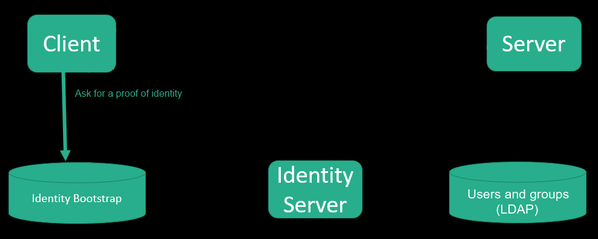
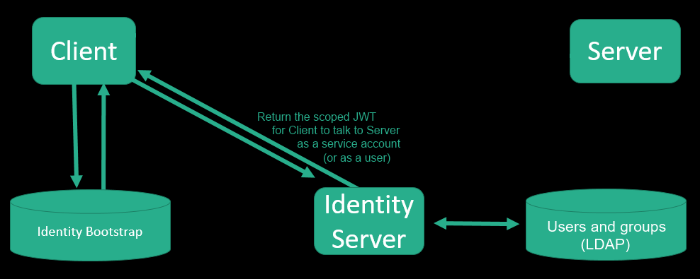

class: title

# Kerberos to OIDC - An Auth journey

???

- Press C to clone the screen
- Press P for "presenter mode" 
- Audience: C3 Conference
- Duration: 25m

---

class: bold

# Welcome

???

Introduce yourself and what we are going to talk about.

---

name: agenda
class: agenda, middle

1. Authentication and authorization
1. OAuth2 and OIDC
1. Human to Service
1. CLI to Service
1. Service to service

???

Reuse this as a template later by using class agenda-2 agenda-3 ...

---

class: bold

_... at the beginning, it was Kerberos ..._

_... one authentication and authorization method to rule them all..._

---

# Kerberos

---

class: bold

# Kerberos (long story short)

---

# What’s good about Kerberos?

- No passwords and secrets sent around;

- Self contained proof of identity and permissions (group memberships);

- Kerberos tokens have single target and can't be replayed;

- Single Sign On at OS level;

- Centralised security (in LDAP, based on group memberships)

???

The user does not need to send a password or secrets around.

When the server asks to negotiate for authentication, the client will obtain a "ticket" from Kerberos Authentication Service as a proof of identity of the user (or service account).
This ticket contains the list of groups the user is a member of. Those groups are the list of permissions for the user.

The ticket is a self contained proof of identity + list of permissions.
The receiver does not need to implement its own authorization, it can rely on integrated (standard) solutions

The ticket can only be decrypted by the designated target.
This means it is not possible for the receiver to replay the ticket to other services, pretending to be the original user.

Humans can take advantage of Windows integrated Kerberos
SSO at OS level - No need to type username/password
(*Running kinit is needed from Linux boxes)
Humans’ permissions can map one to one with Active Directory groups
Centralised security

Services run “as service account”
No need for username/password (on Windows): “Run as svc-my-service”
(*Workaround for linux/K8s: services run kinit on a provided keytab)
Services’ permissions map one to one with Active Directory groups
Centralised security

---

# So why not Kerberos?

- A stored keytab is conceptually equivalent to stored username/password pairs;

- No support for linking across multiple domains (e.g.: cloud bursting); 

- OIDC is the direction the rest of the world is taking.

???

Linux services need a keytab. They need to be stored somewhere.
This is conceptually equivalent to store username/password pairs somewhere.

Communication between Uberit and C3 would require domain trust between the two Active Directory instances
This is against the company view of splitting “the platform” from “the company”.
One of the requirements was to consider Uberit AD as "compromised" and build everything new on top of a clean and secure AD in C3.

This is against the industry trend and what the rest of the world is doing
C3 should be an opportunity to “move forward” – and OIDC is the direction to go

---

# So why not Kerberos?

- A stored keytab is conceptually equivalent to stored username/password pairs;

- No support for linking across multiple domains (e.g.: cloud bursting); 

- OIDC is the direction the rest of the world is taking.

# Design the OIDC solution for GR

- Stay compliant to the OIDC standard;

- Minimize the amount of changes required; 

- Support the transition period.

???

---

# Key points

.important[
  Unified method to authenticate users and services.
]

.important[
  Prevent impersonation attacks.
]

.important[
  Support migration.
]

.important[
  Follow industry standards.
]

---

template: agenda
class: agenda-2

---

class: title

# OAuth2

OAuth 2.0 is the industry-standard protocol for authorization

---

class: bold
# OAuth2

---
class: bold
# OAuth2

---
class: bold
# OAuth2

---
class: bold
# OAuth2

---
class: bold
# OAuth2

---
class: bold
# OAuth2

---
class: bold
# OAuth2

---

#OAuth2

In summary:
- Client (C) needs to talk to Server (S).
- (C) asks an authority (IDS) to issue a signed JWT bearer token.
- IDS verifies (C) identity and returns the JWT, including permissions (claims).
- (S) trusts the authority, so when it receives a valid signed JWT it can trust it.
- (S) replies to (C), accepting or rejecting the request based on the caller permissions.
- If (S) rejects the request, there's no harm in offering the option to "Negotiate"...

---

class: title

# OIDC

OIDC (Open ID Connect) extends OAuth2 to provide authentication

---

#OIDC

- A client (C) needs to prove it is allowed to act on behalf of a user.
- Users do not want to hand over their credentials to (C).
- (C) can also ask for extra info (scopes) about the user (ID Token)
- The user can grant (C) access to personal information
- Client (and Server) must not be able to abuse or misuse the token.
- The JWT bearer token should not need to be handed over to the user (where possible).

---

template: agenda
class: agenda-3

---
class: bold
# OIDC

---
class: bold
# OIDC

---
class: bold
# OIDC

---
class: bold
# OIDC

---
class: bold
# OIDC

---
class: bold
# OIDC

---
class: bold
# OIDC

---
class: bold
# OIDC

---
class: bold
# OIDC

---
class: bold
# OIDC

---

# IDS Authentication

---

template: agenda
class: agenda-4

---
class: bold
# Device flow

---
class: bold
# Device flow

---
class: bold
# Device flow

---
class: bold
# Device flow

---
class: bold
# Device flow

---
class: bold
# Device flow

---
class: bold
# Device flow

---
class: bold
# Device flow

---
class: bold
# Device flow

---
class: bold
# Device flow

---
class: bold
# Device flow

---

template: agenda
class: agenda-5

---

class: title

#How can a service prove its identity?

The identity bootstrap problem

---
class: bold

#Custom grant type

---

# Remember the key points?

.important[
Tokens are proof of identity and permissions for both users and service accounts.
]

.important[
Tokens have a single (API) audience, preventing impersonation attacks.
]

.important[
Kerberos will be accepted for the duration of the migration.
]

.important[
GR OIDC implementation is compliant with the standard.
]

???

Prev key points were:
- Unified method to authenticate users and services.
- Prevent impersonation attacks.
- Support migration.
- Follow industry standards.

---

class: title

# Thank you!

Questions?
